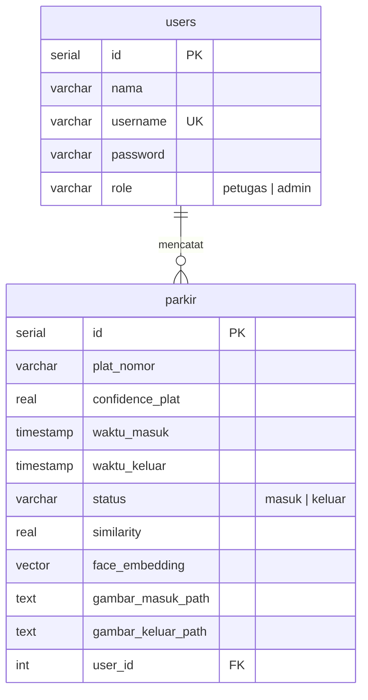

```mermaid
erDiagram
    users {
        serial id PK
        varchar nama
        varchar username UK
        varchar password
        varchar role "petugas | admin"
    }

    parkir {
        serial id PK
        varchar plat_nomor
        real confidence_plat
        timestamp waktu_masuk
        timestamp waktu_keluar
        varchar status "masuk | keluar"
        real similarity
        vector face_embedding
        text gambar_masuk_path
        text gambar_keluar_path
        int user_id FK
    }

    users ||--o{ parkir : "mencatat"
```
